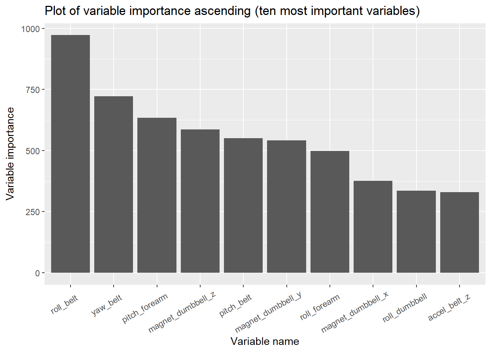
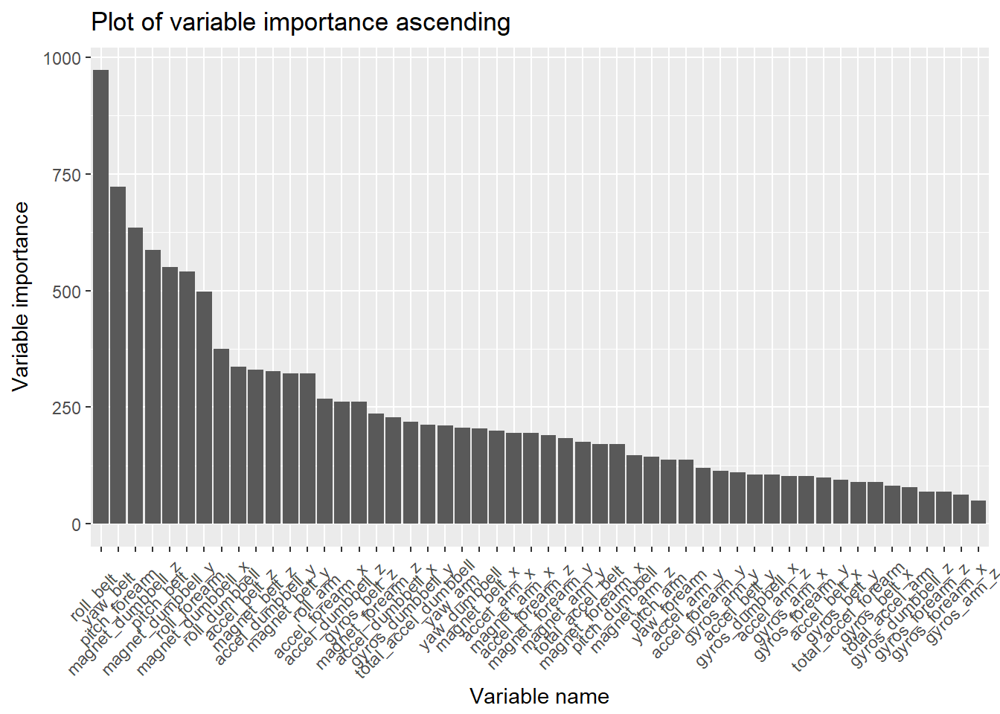
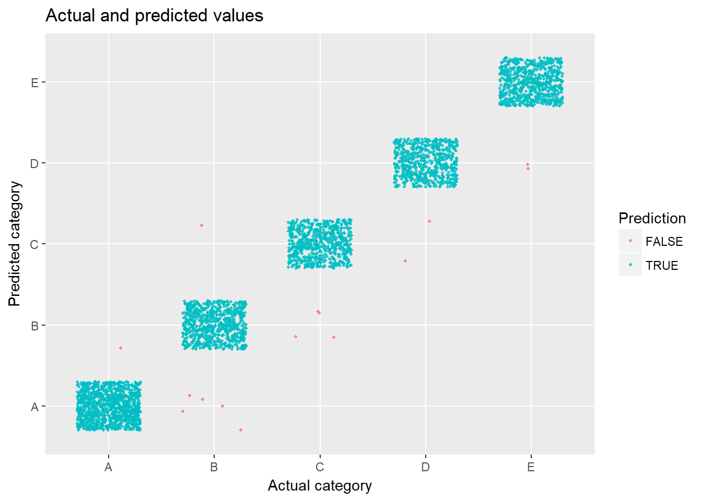

## Executive Summary  
The aim of the project was to use data from movement sensors on the belt, forearm, arm, and dumbell of 6 athletes to predict the manner in which they did the Unilateral Dumbbell Biceps Curl. They were asked to perform one set of 10 repetitions of the exercise in five different ways: exactly according to the specification or making one of 4 common mistakes. If automated detection of the quality of exercise is possible, it can be used for automated feedback, leading potentially to improvement of athletic achievement and reduction of the risk of injury. More information is available from the website here: <http://web.archive.org/web/20161224072740/http:/groupware.les.inf.puc-rio.br/har> (see the section on the Weight Lifting Exercise Dataset). 
We developed a random forest model that was capable of correctly predicting the quality of exercise in around 99.5% of cases.

## Preparation of the dataset  

```r
#load the libraries
library(caret); library(dplyr); library(randomForest); library("doParallel"); library(ggplot2)
#load the training and testing data
if(!file.exists("./pml-training.csv")) {
    fileUrl1 <- "https://d396qusza40orc.cloudfront.net/predmachlearn/pml-training.csv"
    download.file(fileUrl1, destfile = "./pml-training.csv")}
if(!file.exists("./pml-testing.csv")) {
    fileUrl2 <- "https://d396qusza40orc.cloudfront.net/predmachlearn/pml-testing.csv"
    download.file(fileUrl2, destfile = "./pml-testing.csv")}
#name the training and testing datasets
training = read.csv("pml-training.csv")
testing = read.csv("pml-testing.csv")
#display the properties of both datasets
names(training)
```

```
##   [1] "X"                        "user_name"               
##   [3] "raw_timestamp_part_1"     "raw_timestamp_part_2"    
##   [5] "cvtd_timestamp"           "new_window"              
##   [7] "num_window"               "roll_belt"               
##   [9] "pitch_belt"               "yaw_belt"                
##  [11] "total_accel_belt"         "kurtosis_roll_belt"      
##  [13] "kurtosis_picth_belt"      "kurtosis_yaw_belt"       
##  [15] "skewness_roll_belt"       "skewness_roll_belt.1"    
##  [17] "skewness_yaw_belt"        "max_roll_belt"           
##  [19] "max_picth_belt"           "max_yaw_belt"            
##  [21] "min_roll_belt"            "min_pitch_belt"          
##  [23] "min_yaw_belt"             "amplitude_roll_belt"     
##  [25] "amplitude_pitch_belt"     "amplitude_yaw_belt"      
##  [27] "var_total_accel_belt"     "avg_roll_belt"           
##  [29] "stddev_roll_belt"         "var_roll_belt"           
##  [31] "avg_pitch_belt"           "stddev_pitch_belt"       
##  [33] "var_pitch_belt"           "avg_yaw_belt"            
##  [35] "stddev_yaw_belt"          "var_yaw_belt"            
##  [37] "gyros_belt_x"             "gyros_belt_y"            
##  [39] "gyros_belt_z"             "accel_belt_x"            
##  [41] "accel_belt_y"             "accel_belt_z"            
##  [43] "magnet_belt_x"            "magnet_belt_y"           
##  [45] "magnet_belt_z"            "roll_arm"                
##  [47] "pitch_arm"                "yaw_arm"                 
##  [49] "total_accel_arm"          "var_accel_arm"           
##  [51] "avg_roll_arm"             "stddev_roll_arm"         
##  [53] "var_roll_arm"             "avg_pitch_arm"           
##  [55] "stddev_pitch_arm"         "var_pitch_arm"           
##  [57] "avg_yaw_arm"              "stddev_yaw_arm"          
##  [59] "var_yaw_arm"              "gyros_arm_x"             
##  [61] "gyros_arm_y"              "gyros_arm_z"             
##  [63] "accel_arm_x"              "accel_arm_y"             
##  [65] "accel_arm_z"              "magnet_arm_x"            
##  [67] "magnet_arm_y"             "magnet_arm_z"            
##  [69] "kurtosis_roll_arm"        "kurtosis_picth_arm"      
##  [71] "kurtosis_yaw_arm"         "skewness_roll_arm"       
##  [73] "skewness_pitch_arm"       "skewness_yaw_arm"        
##  [75] "max_roll_arm"             "max_picth_arm"           
##  [77] "max_yaw_arm"              "min_roll_arm"            
##  [79] "min_pitch_arm"            "min_yaw_arm"             
##  [81] "amplitude_roll_arm"       "amplitude_pitch_arm"     
##  [83] "amplitude_yaw_arm"        "roll_dumbbell"           
##  [85] "pitch_dumbbell"           "yaw_dumbbell"            
##  [87] "kurtosis_roll_dumbbell"   "kurtosis_picth_dumbbell" 
##  [89] "kurtosis_yaw_dumbbell"    "skewness_roll_dumbbell"  
##  [91] "skewness_pitch_dumbbell"  "skewness_yaw_dumbbell"   
##  [93] "max_roll_dumbbell"        "max_picth_dumbbell"      
##  [95] "max_yaw_dumbbell"         "min_roll_dumbbell"       
##  [97] "min_pitch_dumbbell"       "min_yaw_dumbbell"        
##  [99] "amplitude_roll_dumbbell"  "amplitude_pitch_dumbbell"
## [101] "amplitude_yaw_dumbbell"   "total_accel_dumbbell"    
## [103] "var_accel_dumbbell"       "avg_roll_dumbbell"       
## [105] "stddev_roll_dumbbell"     "var_roll_dumbbell"       
## [107] "avg_pitch_dumbbell"       "stddev_pitch_dumbbell"   
## [109] "var_pitch_dumbbell"       "avg_yaw_dumbbell"        
## [111] "stddev_yaw_dumbbell"      "var_yaw_dumbbell"        
## [113] "gyros_dumbbell_x"         "gyros_dumbbell_y"        
## [115] "gyros_dumbbell_z"         "accel_dumbbell_x"        
## [117] "accel_dumbbell_y"         "accel_dumbbell_z"        
## [119] "magnet_dumbbell_x"        "magnet_dumbbell_y"       
## [121] "magnet_dumbbell_z"        "roll_forearm"            
## [123] "pitch_forearm"            "yaw_forearm"             
## [125] "kurtosis_roll_forearm"    "kurtosis_picth_forearm"  
## [127] "kurtosis_yaw_forearm"     "skewness_roll_forearm"   
## [129] "skewness_pitch_forearm"   "skewness_yaw_forearm"    
## [131] "max_roll_forearm"         "max_picth_forearm"       
## [133] "max_yaw_forearm"          "min_roll_forearm"        
## [135] "min_pitch_forearm"        "min_yaw_forearm"         
## [137] "amplitude_roll_forearm"   "amplitude_pitch_forearm" 
## [139] "amplitude_yaw_forearm"    "total_accel_forearm"     
## [141] "var_accel_forearm"        "avg_roll_forearm"        
## [143] "stddev_roll_forearm"      "var_roll_forearm"        
## [145] "avg_pitch_forearm"        "stddev_pitch_forearm"    
## [147] "var_pitch_forearm"        "avg_yaw_forearm"         
## [149] "stddev_yaw_forearm"       "var_yaw_forearm"         
## [151] "gyros_forearm_x"          "gyros_forearm_y"         
## [153] "gyros_forearm_z"          "accel_forearm_x"         
## [155] "accel_forearm_y"          "accel_forearm_z"         
## [157] "magnet_forearm_x"         "magnet_forearm_y"        
## [159] "magnet_forearm_z"         "classe"
```

The initial dataset consisted of 19622 observations of 160 variables. Beside index, user identification and time related data specific for individual users, the dataset contained three-dimensional raw data from accelerometer, gyroscope and magnetometer - sensors mounted in the users' glove, armband, lumbar belt and dumbbell. The researchers calculated also eight features: mean, variance, standard deviation, max, min, amplitude, kurtosis and skewness for the Euler angles of each of the four sensors, generating in total 96 derived feature sets. Most of the derived variables were later excluded from the analysis because of large amount of missing data. The dependent variable was the manner in which the athletes performed the exercise: exactly according to the specification (Class A), throwing the elbows to the front (Class B), lifting the dumbbell only halfway (Class C), lowering the dumbbell only halfway (Class D) and throwing the hips to the front (Class E). 


```r
#identify the number of missing values for each variable
missingi <- data.frame(mis = sapply(training, function(x) sum(is.na(x))))
#calculate the proportion of missing values for each variable
missingi$procmis <- round(missingi$mis/nrow(training),3)
#display all levels of proportions of missing values
table(missingi$procmis)
```

```
## 
##     0 0.979 
##    93    67
```

```r
#exclude variables with high amount of missing values from the dataset
training <- training[,missingi$mis==0]
#identify variables with near zero variance
nzv_an <- nearZeroVar(training,saveMetrics = T)
#exclude variables with near zero variance
training <- training[,nzv_an$nzv=="FALSE"]
new <- training[,-c(1:6)]
#split the dataset for training and validation
inTrain <- createDataPartition(y=new$classe,p=0.8, list=FALSE)
train <- new[inTrain,]; val <- new[-inTrain,]
```

93 variables contained no missing values, while the remaining 67 variables contained each exactly 19216 missing values out of 19622 observations (97.9%). The latter were excluded from the dataset. The next step was to exclude variables with near zero variance. Finally, we excluded several user specific variables that wouldn't be suitable for prediction, such as names of the participants, row numbers and time stamps. The final dataset contained 53 variables, including one categorical, 5-level dependent variable, "classe", and 52 potential predictors, of which 25 were integer and 27 were numeric.. It was then split into a training and validation subset, consisting of 15699 and 3923 observations, reslectively.  


```r
#display frequencies for the levels of dependent variable in the train dataset
table(train$classe)
```

```
## 
##    A    B    C    D    E 
## 4464 3038 2738 2573 2886
```

## Model fitting and testing  
Our first choice to predict categorical dependent variable by numeric predictors was the random forest classification method. Random forest is an extension of bagging on classification/regression trees. It involves repeated bootstraping samples, testing various splits of classification trees and voting final model. This method doesn't require data normalization or log transformations and performs internal validation to assess OOB error.


```r
#enable parallel processing
cl <- makePSOCKcluster(5)
registerDoParallel(cl)
#fit the random forest model on the training dataset
rf<-randomForest(train$classe ~ ., data=train, prox=TRUE, ntree=500)
rf
```

```
## 
## Call:
##  randomForest(formula = train$classe ~ ., data = train, prox = TRUE,      ntree = 500) 
##                Type of random forest: classification
##                      Number of trees: 500
## No. of variables tried at each split: 7
## 
##         OOB estimate of  error rate: 0.42%
## Confusion matrix:
##      A    B    C    D    E class.error
## A 4461    3    0    0    0 0.000672043
## B   16 3018    4    0    0 0.006583278
## C    0   12 2725    1    0 0.004747991
## D    0    0   21 2550    2 0.008938982
## E    0    0    0    7 2879 0.002425502
```

The procedure was capable of correctly classifying around 99.5% of the observations from the dataset. The estimated rate of OOB error was below 0.5%.  
The importance of the predictor variables is listed and plotted below.


```r
#display the variable importance
vimp <- as.data.frame(varImp(rf))
vimp <- data.frame(names   = rownames(vimp),overall = vimp$Overall)
vimp <- vimp[order(vimp$overall,decreasing = T),]
vimp
```

```
##                   names    overall
## 1             roll_belt 1033.12897
## 3              yaw_belt  722.12775
## 39    magnet_dumbbell_z  615.92960
## 41        pitch_forearm  607.52834
## 38    magnet_dumbbell_y  544.71267
## 2            pitch_belt  542.56364
## 40         roll_forearm  475.86315
## 37    magnet_dumbbell_x  406.11229
## 27        roll_dumbbell  330.90906
## 35     accel_dumbbell_y  329.25127
## 13        magnet_belt_z  328.95563
## 10         accel_belt_z  325.31441
## 12        magnet_belt_y  295.94145
## 36     accel_dumbbell_z  278.27258
## 14             roll_arm  252.58645
## 47      accel_forearm_x  245.46342
## 7          gyros_belt_z  235.52221
## 52     magnet_forearm_z  227.57868
## 30 total_accel_dumbbell  215.31136
## 24         magnet_arm_x  203.19555
## 21          accel_arm_x  202.52937
## 29         yaw_dumbbell  202.00212
## 16              yaw_arm  201.39921
## 11        magnet_belt_x  199.90406
## 34     accel_dumbbell_x  195.46683
## 49      accel_forearm_z  190.16763
## 32     gyros_dumbbell_y  185.23686
## 4      total_accel_belt  180.15051
## 50     magnet_forearm_x  178.28460
## 25         magnet_arm_y  174.69627
## 51     magnet_forearm_y  173.44576
## 26         magnet_arm_z  150.08787
## 28       pitch_dumbbell  145.35247
## 15            pitch_arm  137.90987
## 42          yaw_forearm  134.35071
## 22          accel_arm_y  123.10188
## 48      accel_forearm_y  111.55012
## 19          gyros_arm_y  110.63082
## 31     gyros_dumbbell_x  106.21817
## 18          gyros_arm_x  105.13084
## 23          accel_arm_z  101.72567
## 45      gyros_forearm_y  101.38048
## 9          accel_belt_y  100.07470
## 8          accel_belt_x   94.09702
## 43  total_accel_forearm   92.92968
## 6          gyros_belt_y   90.02259
## 5          gyros_belt_x   79.17186
## 17      total_accel_arm   78.87694
## 33     gyros_dumbbell_z   69.38685
## 46      gyros_forearm_z   67.48486
## 44      gyros_forearm_x   63.10849
## 20          gyros_arm_z   49.28955
```

```r
#plot ten most important variables
p <- ggplot(vimp[1:10,], aes(x = reorder(names, -overall), y = overall)) +
         geom_bar(stat = "identity") + theme(axis.text.x=element_text(angle=30,vjust=.8, hjust=0.8)) + ggtitle("Plot of variable importance descending (ten most important variables)") +
  xlab("Variable name") + ylab("Variable importance")
p
```

<!-- -->

```r
#plot all the variables ordered by importance
p1 <- ggplot(vimp, aes(x = reorder(names, -overall), y = overall)) +
         geom_bar(stat = "identity") + theme(axis.text.x=element_text(angle=45,vjust=.8, hjust=0.8)) + ggtitle("Plot of variable importance descending") +
  xlab("Variable name") + ylab("Variable importance")
p1
```

<!-- -->

As we can see, the variables which contributed to the model the most, were mostly readings from belt and dumbbell devices, followed by the sensors attached to the forarm. Sensors mounted on the athlete's arm were apparently of lesser importance.

## Validation


```r
#test the model on the validation dataset
pred_val <- predict(rf, val)
cm <- confusionMatrix(pred_val, val$classe)
cm
```

```
## Confusion Matrix and Statistics
## 
##           Reference
## Prediction    A    B    C    D    E
##          A 1116    0    0    0    0
##          B    0  759    1    0    0
##          C    0    0  683    8    0
##          D    0    0    0  635    2
##          E    0    0    0    0  719
## 
## Overall Statistics
##                                          
##                Accuracy : 0.9972         
##                  95% CI : (0.995, 0.9986)
##     No Information Rate : 0.2845         
##     P-Value [Acc > NIR] : < 2.2e-16      
##                                          
##                   Kappa : 0.9965         
##  Mcnemar's Test P-Value : NA             
## 
## Statistics by Class:
## 
##                      Class: A Class: B Class: C Class: D Class: E
## Sensitivity            1.0000   1.0000   0.9985   0.9876   0.9972
## Specificity            1.0000   0.9997   0.9975   0.9994   1.0000
## Pos Pred Value         1.0000   0.9987   0.9884   0.9969   1.0000
## Neg Pred Value         1.0000   1.0000   0.9997   0.9976   0.9994
## Prevalence             0.2845   0.1935   0.1744   0.1639   0.1838
## Detection Rate         0.2845   0.1935   0.1741   0.1619   0.1833
## Detection Prevalence   0.2845   0.1937   0.1761   0.1624   0.1833
## Balanced Accuracy      1.0000   0.9998   0.9980   0.9935   0.9986
```

We then tested the algorithm on the validation dataset. The model predicted the value of dependent variable with very high accuracy of 0.997196. The algorithm was able to classify almost all observations to the correct categories. The plot below demonstrates observations from the validation dataset, correctly and incorrectly classified into categories.


```r
#plot actual vs. predicted datapoints
val$Prediction <- pred_val==val$classe
ggplot(aes(x=classe, y = pred_val,colour=Prediction), data = val) + geom_jitter(size=0.8,alpha=0.8,width = 0.3, height = 0.3) + ggtitle("Actual and predicted values") +
  xlab("Actual category") + ylab("Predicted category")
```

<!-- -->

Only few datapoints fall outside the correct categories. As we can see, the random forest algorithm correctly classified almost all observations.

Lastly, we tested our model on the testing dataset and predicted the following values. External validation on the Coursera Machine Learning website confirmed the accuracy of predictions.  


```r
pred_testing <- predict(rf, testing)
pred_testing
```

```
##  1  2  3  4  5  6  7  8  9 10 11 12 13 14 15 16 17 18 19 20 
##  B  A  B  A  A  E  D  B  A  A  B  C  B  A  E  E  A  B  B  B 
## Levels: A B C D E
```


```r
#disable parallel processing
stopCluster(cl)
```

## Summary  
The random forest procedure performed on the readings from movement sensors allowed for very accurate classification of almost all observations in the validation dataset into the correct categories. This means that the correct performance of athletic exercise as well as common mistakes can be accurately detected by algorithms. This allows for designing devices capable of providing precise automatic guidance and feedback to athletes, which may speed up the development of athletic skills and prevent injuries resulting from unrecognized mistakes.  
Among the limitations of the study it is worth mentioning that the "common mistakes" made by the study participants were artificially staged and might have been exagerated, which may not necessarily resemble more nuanced instances of real mistakes made by actual athletes in real life situations. The actual mistakes may have different degress, they can also consist of a mixture of various types of errors or contain various proportion of correct and incorrect movements. This means that the sensor readings from real-life training sessions might be more blurred than those obtained in the study. In this case the predictive value of the model might turn out to be much lower.

##References
Velloso, E.; Bulling, A.; Gellersen, H.; Ugulino, W.; Fuks, H. Qualitative Activity Recognition of Weight Lifting Exercises. Proceedings of 4th International Conference in Cooperation with SIGCHI (Augmented Human '13) . Stuttgart, Germany: ACM SIGCHI, 2013.
